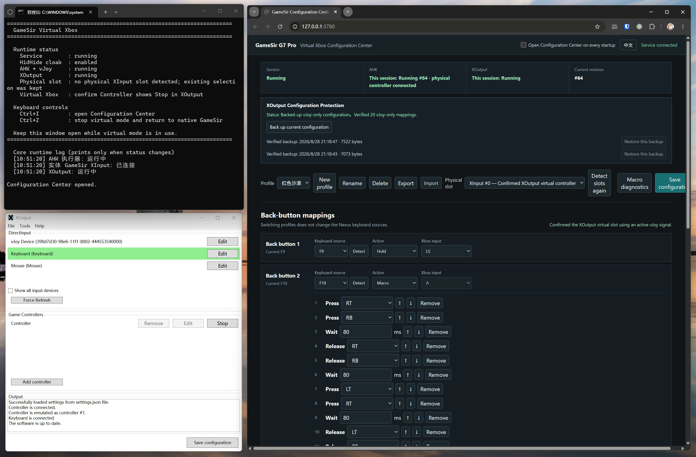

[简体中文](./README.md) | [English](./README.en.md)

# GameSir G7 Pro Buttons Supports Macro



# Introduction

The GameSir G7 Pro is an officially licensed Xbox controller, but it does not support configurable macros. This project turns its four back buttons into configurable standard Xbox/XInput actions. In theory, this approach should work with any officially licensed Xbox controller that has back buttons, but it has only been tested with the GameSir G7 Pro.

How it works:

```text
Official GameSir Nexus software (configures the back buttons to output F9-F12)
  → AutoHotkey (receives standard controller input and F9-F12 from the back buttons,
    merges them, and forwards the result to vJoy)
  → vJoy Device 1 (the merged virtual device; XOutput cannot directly receive
    F9-F12 from the physical controller)
  → XOutput (converts vJoy into a controller Steam can recognize directly;
    without this layer, vJoy buttons must be bound manually in Steam)
  → Virtual Xbox/XInput controller

HidHide → Hides the physical controller to prevent input conflicts
```

## What each application does

GameSir Nexus: Configures the back buttons as keyboard keys.

AutoHotkey: Receives controller and keyboard input and forwards it through the vJoy virtual controller.

vJoy: Merges the inputs into a single controller.

XOutput: Converts the merged device into a ready-to-use virtual Xbox controller.

### Q: Why not connect the controller directly to XOutput?

XOutput does not recognize the controller's F9-F12 back-button outputs.

### Q: Why not use vJoy directly in Steam games?

vJoy requires manual button binding in Steam, and the binding experience is poor.

### Q: Why is HidHide needed?

Without hiding the physical controller, its input can conflict with the virtual controller.

### Q: Is rumble supported?

Rumble has been tested and works. Force feedback must be configured in both vJoy and XOutput.

### Q: Can the Home/Guide button be mapped?

The physical Home/Guide button cannot be bound in XOutput, but it still responds in games.

## Requirements

- Windows and a GameSir G7 Pro.
- GameSir Nexus: configure P1/P2/P3/P4 to output `F9`/`F10`/`F11`/`F12`.
- Node.js available through `node --version`.
- AutoHotkey v2 x64. Daily use must run the allow-listed `AutoHotkey64.exe`.
- vJoy 2.1.9.1 with Device 1 configured for 18 buttons, six axes, and one POV.
- ViGEmBus, HidHide, and XOutput.
- The XOutput Controller must use `vJoy Device` as its only input source. Do not mix in Keyboard or the physical GameSir.

Drivers and third-party tools are not distributed in this repository. See the [English runbook](./gamesir_virtual_xbox_runbook.en.md) for installation, exact configuration, acceptance checks, and troubleshooting. Never copy another computer's HidHide device instance paths.

## Daily use

1. Connect the GameSir and double-click [start_gamesir_virtual_xbox.cmd](./start_gamesir_virtual_xbox.cmd).
2. The Configuration Center opens by default. Clear **Open Configuration Center on every startup** in the top-right corner if you do not need it during daily use. Press `Ctrl+I` in the launcher window to open it manually.
3. In XOutput, confirm that the target Controller button under `Game Controllers` says `Stop`. A running XOutput process alone does not prove that virtual Xbox output is active.
4. After closing the game, press `Ctrl+Z` in the launcher or run [stop_gamesir_virtual_xbox.cmd](./stop_gamesir_virtual_xbox.cmd).

The Configuration Center listens only on `http://127.0.0.1:3780` by default. It does not provide LAN or remote access.

Use the top-right language button to switch the Configuration Center between Chinese and English. The launcher and stop script default to Chinese; set `$env:GAMESIR_LANG = 'en'` before launching to use English console messages.

## Files and directories

| File or directory | Purpose |
| --- | --- |
| `start_gamesir_virtual_xbox.cmd` / `.ps1` | Starts or reuses the configuration service, AHK, and XOutput for this session, then enables the HidHide cloak. |
| `stop_gamesir_virtual_xbox.cmd` / `.ps1` | Stops only components owned by this session, then safely disables the cloak. |
| `gamesir_merge_vjoy_f9_f12.ahk` | AutoHotkey v2 input merger, back-button action engine, and macro executor. |
| `app/server/` | Local configuration, status, lifecycle, and WebSocket service. |
| `app/web/` | Browser-based Configuration Center. |
| `runtime/` | Machine-local configuration, status, logs, and backups generated at runtime; never commit it. |
| `gamesir_virtual_xbox_runbook.md` / `.en.md` | Complete Chinese and English setup and troubleshooting manuals for users and agents. |
| `AGENTS.md` | Mandatory implementation and safety boundaries for coding agents. |

## Tool path discovery

The launcher finds Node.js through `PATH` and tries common locations for AHK, vJoy, XOutput, and HidHide. If discovery fails, set these variables in the same PowerShell window:

```powershell
$env:GAMESIR_AHK_EXE = 'C:\path\to\AutoHotkey64.exe'
$env:GAMESIR_VJOY_DLL = 'C:\Program Files\vJoy\x64\vJoyInterface.dll'
$env:GAMESIR_XOUTPUT_EXE = 'C:\path\to\XOutput.exe'
$env:GAMESIR_HIDHIDE_CLI = 'C:\path\to\HidHideCLI.exe'
.\start_gamesir_virtual_xbox.cmd
```

Do not commit machine-specific absolute paths or a user's XOutput settings.

## Development verification

The project has no third-party npm dependencies:

```powershell
node --test app/server/*.test.mjs
```

Before changing mappings, startup behavior, vJoy, XOutput, or HidHide integration, read [AGENTS.md](./AGENTS.md) and the complete runbook.
