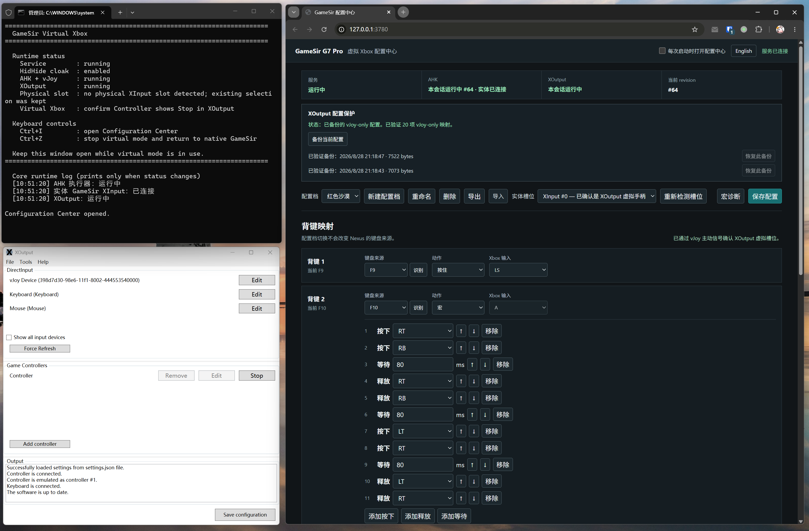

[简体中文](./README.md) | [English](./README.en.md)

# 小鸡 G7 Pro / GameSir G7 Pro 支持宏定义



# 项目介绍

GameSir G7 Pro 是 XBox 授权的手柄，无法配置宏按键。本项目让 GameSir G7 Pro 的四个背键执行可配置的标准 Xbox/XInput 动作。方案理论上适用于所有 XBox 授权的带背键的手柄，我只有 GameSir G7 Pro 没有进行其他测试。

方案：

```text
官方软件 GameSir Nexus（配置背键输出 F9-F12）
  → AutoHotkey（接收手柄普通输出 + 背键输出的 F9-F12，合并实体输入与背键动作，转发给 vJoy）
  → vJoy Device 1（合并后的虚拟设备，XOutput 无法直接接收物理手柄的 F9-F12）
  → XOutput（转换为可以被 Steam 直接识别的手柄，没有这一层 vJoy 需要在 Steam 配置按键）
  → 虚拟 Xbox/XInput 手柄

HidHide → 隐藏物理手柄，避免输入冲突
```

## 每个软件的作用

官方软件 GameSir Nexus：把背键配置为键盘按键。
AutoHotKey：接收手柄和键盘的输入，统一转到 vJoy 虚拟手柄。
vJoy：合并输出为一个手柄按键。
XOutput：转换为可直接使用的 XBox 虚拟手柄；

### Q: 为什么不直接手柄 -> XOutput
因为发现 XOutput 不认手柄的 F9-F12

### Q：为什么不直接 vJoy -> Steam 游戏
因为发现 vJoy 需要在 Steam 上进行按键绑定，且绑定体验不好

### Q：为什么需要 HideHide
不隐藏物理手柄，会出现抢输入的情况

### Q：是否支持震动
实测支持震动。vJoy 和 XOutput 都需要设置 force feedback。

### Q：是否可以绑定 Home/西瓜键
实体 Home/西瓜键无法绑定到 XOutput，但实际上在游戏中可响应。

## 使用要求

- Windows 与 GameSir G7 Pro。
- GameSir Nexus：将 P1/P2/P3/P4 设置为 `F9`/`F10`/`F11`/`F12`。
- Node.js：需能在命令行执行 `node --version`。
- AutoHotkey v2 x64：日常必须使用 HidHide 白名单中的 `AutoHotkey64.exe`。
- vJoy 2.1.9.1：Device 1 使用 18 个按钮、6 个轴和 1 个 POV。
- ViGEmBus、HidHide、XOutput。
- XOutput 的 Controller 必须只读取 `vJoy Device`，不能混用 Keyboard 或实体 GameSir。

驱动和第三方工具不随仓库分发。首次安装、精确配置和验收步骤全部见 [运行手册](./gamesir_virtual_xbox_runbook.md)。不要复制其他电脑的 HidHide 设备实例路径。

## 日常使用

1. 连接 GameSir，双击 [start_gamesir_virtual_xbox.cmd](./start_gamesir_virtual_xbox.cmd)。
2. 首次默认会打开配置中心。右上角取消“每次启动时打开配置中心”后，后续启动不会打开网页；需要时可在启动器窗口按 `Ctrl+I`。
3. 在 XOutput 的 `Game Controllers` 中确认目标 Controller 按钮显示 `Stop`。仅有 XOutput 进程不代表虚拟 Xbox 已开始输出。
4. 结束游戏后在启动器窗口按 `Ctrl+Z`，或运行 [stop_gamesir_virtual_xbox.cmd](./stop_gamesir_virtual_xbox.cmd)。

配置中心默认仅监听 `http://127.0.0.1:3780`，不提供局域网或远程访问。

配置中心可在右上角切换中文/English。启动器和停止器默认使用中文；在启动前设置 `$env:GAMESIR_LANG = 'en'` 可使用英文控制台语料。

## 文件与目录

| 文件或目录 | 作用 |
| --- | --- |
| `start_gamesir_virtual_xbox.cmd` / `.ps1` | 启动或复用本会话的配置服务、AHK 和 XOutput，并开启 HidHide cloak。 |
| `stop_gamesir_virtual_xbox.cmd` / `.ps1` | 只停止本会话拥有的组件，再安全关闭 cloak。 |
| `gamesir_merge_vjoy_f9_f12.ahk` | AHK v2 输入合并、背键动作和宏执行器。 |
| `app/server/` | 本地配置、状态、生命周期和 WebSocket 服务。 |
| `app/web/` | 浏览器配置中心。 |
| `runtime/` | 本机首次运行时生成的配置、状态、日志与备份；不应提交到 Git。 |
| `gamesir_virtual_xbox_runbook.md` | 面向用户和 Agent 的完整配置、验收与排障手册。 |
| `AGENTS.md` | Agent 修改本项目时必须遵守的实现边界。 |

## 路径自动发现

启动器从 `PATH` 查找 Node.js，并尝试常见的 AHK、vJoy、XOutput 和 HidHide 路径。自动发现失败时，在同一个 PowerShell 窗口设置：

```powershell
$env:GAMESIR_AHK_EXE = 'C:\path\to\AutoHotkey64.exe'
$env:GAMESIR_VJOY_DLL = 'C:\Program Files\vJoy\x64\vJoyInterface.dll'
$env:GAMESIR_XOUTPUT_EXE = 'C:\path\to\XOutput.exe'
$env:GAMESIR_HIDHIDE_CLI = 'C:\path\to\HidHideCLI.exe'
.\start_gamesir_virtual_xbox.cmd
```

不要把本机绝对路径或 XOutput 的用户配置提交到仓库。

## 开发验证

本项目没有 npm 第三方依赖：

```powershell
node --test app/server/*.test.mjs
```

修改映射、启动、vJoy、XOutput 或 HidHide 链路前，必须先阅读 [AGENTS.md](./AGENTS.md) 和完整运行手册。
